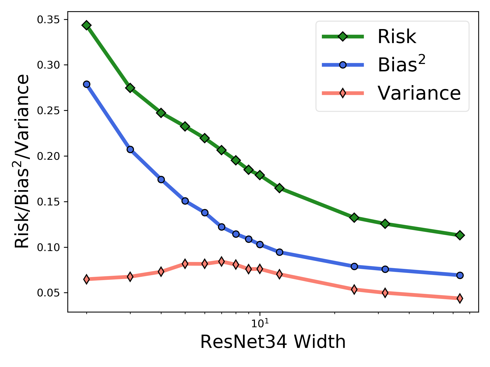
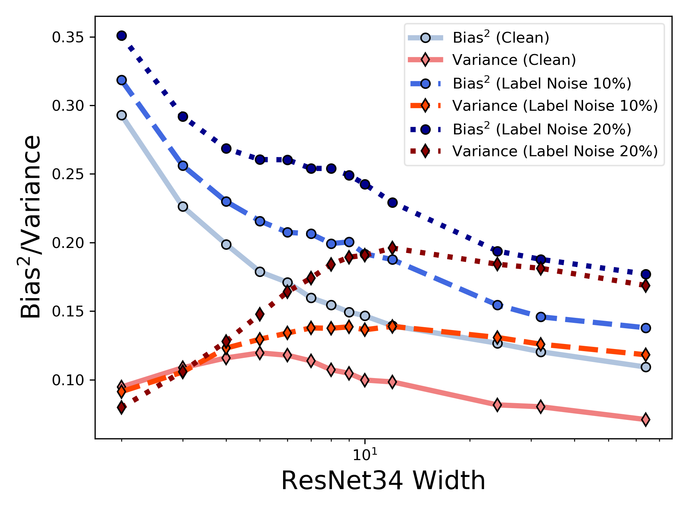
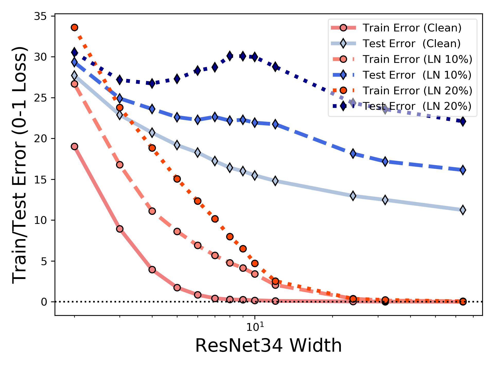

# Rethink-BiasVariance-Tradeoff

This is the code for the paper "Rethinking Bias-Variance Trade-off for Generalization of Neural Networks".

<p align="center">
    
</p>
<p align="center">
<b>Risk, bias, and variance for ResNet34 on CIFAR10 dataset (25,000 training samples).<b>
</p>

## Prerequisites
* Python
* Pytorch (1.3.1)
* CUDA
* numpy


## How to train models on different datasets (MSE loss & MSE bias-variance decomposition)?
There are 4 folders, ```cifar10```, ```cifar100```, ```fmnist```, and ```mnist```. First ```cd``` into the directory. Then run
```text
python train.py --trial 2 --arch resnet34 --width 10 --num-epoch 500 --lr-decay --outdir part1
```
### Arguments:
* ```trial```: how many splits, i.e., if ```trial=2``` on ```cifar10```, then the trainig sample size is ```50000/2 = 25000```.
* ```arch```: network architecture.
* ```width```: width of the network.
* ```num-epoch```: how many epochs for training.
* ```lr-decay```: after how many epochs to decay the learning rate.
* ```outdir```: specify the name of the folder for saving logs and checkpoints.

### Log file:
The results (including bias and variance) will be save in ```'log_width{}.txt'.format(args.width) ```, in the folder ```'{}_{}_trial{}_mse{}'.format(args.dataset, args.arch, args.trial, args.outdir)```. 

The log file includes the following,

| trial | train loss  | train acc | test loss | test acc | bias | variance |
| --------------------- | ------------- | ------------| ------------ |--------------- |-------- | ------- | 


## How to train models on CIFAR10 datasets with label noise?
<p align="center">
    
</p>
<p align="center">
<b>Bias and variance under different label noise percentage. Increasing label noise leads to double-descent phenomenon. ResNet34 using MSE loss on CIFAR10 dataset with 10,000 training samples. <b>
</p>
	
<p align="center">
    
</p>
<p align="center">
<b>Training error and test error under different label noise percentage. Increasing label noise leads to double-descent phenomenon. ResNet34 using MSE loss on CIFAR10 dataset with 10,000 training samples. <b>
</p>


 First ```cd``` into the ```cifar10``` folder. Then run
```text
python train_labelnoise.py --trial 5 --arch resnet34 --width 10 --noise-size 1000
```
### Arguments:
* ```noise-size```: specify the number of label noise for each split of the dataset. For example, here ```trial=5```, the training sample size is ```10000```, the label noise size is ```1000```, which means that the label noise percentage is ```1000/10000=10%```.

### Log file:
The results (including bias and variance) will be save in ```'log_width{}.txt'.format(args.width)```, in the folder ```'{}_{}_trial{}_labelnoise{}_mse{}'.format(args.dataset, args.arch, args.trial, args.noise_size, args.outdir)```. 

## How to train models on CIFAR10 datasets with cross-entropy loss (CE loss & generalized Bregman divergence bias-variance decomposition)?
 First ```cd``` into the ```cifar10``` folder. Then run
```text
python train_ce.py --trial 5 --arch resnet34 --width 10
```

### Log file:
The results (including bias and variance) will be save in ```'log_width{}.txt'.format(args.width)```, in the folder ```'{}_{}_trial{}_ce{}'.format(args.dataset, args.arch, args.trial, args.outdir)```. 

The bias and variance save in ```'log_width{}.txt'.format(args.width)``` is the classical MSE bias variance decomposition. To compute the generalized Bregman divergence bias variance decomposition, need to run

```text
python evaluate_bv_ce.py --model-dir-list cifar10_resnet34_trial5_cepart1 cifar10_resnet34_trial5_cepart2 --outdir ce_bv_results --width 10
```

### Arguments:
* ```model-dir-list```: specify the folders for evaluations. For example, here we will calculate the bias and variance based on the models (```width=10```) saved in ```cifar10_resnet34_trial5_cepart1``` and ```cifar10_resnet34_trial5_cepart2```. The total number of models is ```5 * 2 = 10```.
* ```outdir```: the folder name for saving the computed results.


## How to evaluate bias variance on CIFAR10-C (out-of-distribution) dataset (MSE divergence bias-variance decomposition)?
First, ```cd``` into the ```cifar10``` folder, then download CIFAR-10-C dataset by
```
mkdir -p ./data/cifar
curl -O https://zenodo.org/record/2535967/files/CIFAR-10-C.tar
curl -O https://zenodo.org/record/3555552/files/CIFAR-100-C.tar
tar -xvf CIFAR-100-C.tar -C data/cifar/
tar -xvf CIFAR-10-C.tar -C data/cifar/
```
next, run
```text
python evaluate_bv_mse_ood.py --modeldir cifar10_resnet34_trial2_mse --outdir ood_bv_results --width 10
```
### Log file:
The results (including bias and variance) will be save in ```'log_width{}.txt'.format(args.width)```, in the folder ```ood_bv_results```. 


### Arguments:
* ```modeldir```: specify the folder for evaluations.
* ```outdir```: the folder name for saving the computed results.


## Reference
For technical details and full experimental results, please check [the paper](https://todo).
```
@article{todo, 
	author = {todo}, 
	title = {Rethinking Bias-Variance Trade-off for Generalization of Neural Networks}, 
	journal = {todo},
	year = {2020}
}
```
